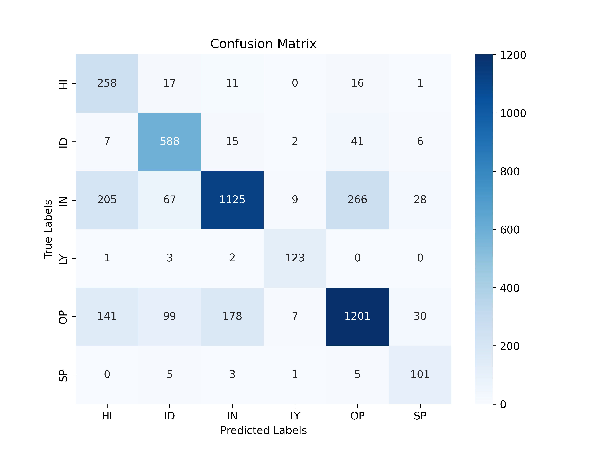

# Text Classification Project: Comparative Analysis of Deep Learning and Classical Machine Learning Models

## Overview

This project explores multiple approaches for text classification on a domain-specific dataset, focusing on both **Deep Learning models** and **Classical Machine Learning models**. The goal is to evaluate and compare the performance of these models on both full-length texts and summarized versions of the texts.

---

## Dataset

The original dataset used for training and testing can be downloaded from the following source:  
[CORE Corpus - TurkuNLP GitHub](https://github.com/TurkuNLP/CORE-corpus)

- The script `prepare_balanced_text_dataset.py` is provided to preprocess and balance the dataset, including removal of unwanted classes and encoding labels.

---

## Project Structure

```

/Project\_D/
│
├── prepare\_balanced\_text\_dataset.py       # Data preprocessing and balancing script
├── requirements.txt                        # Python dependencies
│
├── bert\_base\_model/
│   ├── bert\_base\_model.ipynb
│   ├── classification\_report.png
│   ├── confusion\_matrix.png
│   └── loss\_f1\_curve.png
│
├── bert\_base\_model\_summarize/
│   ├── bert\_base\_model\_summarize.ipynb
│   ├── classification\_report.png
│   ├── confusion\_matrix.png
│   └── loss\_f1\_curve.png
│
├── roberta\_model/
│   ├── roberta\_model.ipynb
│   ├── classification\_report.png
│   ├── confusion\_matrix.png
│   └── loss\_f1\_curve.png
│
├── roberta\_model\_summarize/
│   ├── roberta\_model\_summarize.ipynb
│   ├── classification\_report.png
│   ├── confusion\_matrix.png
│   └── loss\_f1\_curve.png
│
├── machine\_learning/
│   ├── machine\_learning.ipynb
│   ├── classification\_report.png
│   └── confusion\_matrix.png
│
└── machine\_learning\_summarize/
├── machine\_learning\_summarize.ipynb
├── classification\_report.png
└── confusion\_matrix.png

````

---

## Models and Approaches

### Deep Learning Models

- **BERT Base** (Full text) — Folder: `bert_base_model`  
- **BERT Base Summarize** (Summarized text) — Folder: `bert_base_model_summarize`  
- **RoBERTa Base** (Full text) — Folder: `roberta_model` — *Best performing model*  
- **RoBERTa Base Summarize** (Summarized text) — Folder: `roberta_model_summarize`  

These models are fine-tuned transformer architectures utilizing the HuggingFace library. Training and evaluation include plotting of loss and F1 score curves saved as `loss_f1_curve.png` in each folder.

---

### Classical Machine Learning Models

- Implemented in folders `machine_learning` (full text) and `machine_learning_summarize` (summarized text).  
- Models include Logistic Regression, Random Forest, LightGBM, and an ensemble Voting Classifier.  
- Use TF-IDF vectorization and Chi-squared feature selection.

---

## Performance Summary

| Model                       | Data Type         | Accuracy  |
|-----------------------------|-------------------|-----------|
| RoBERTa Base                | Full text         | **0.7444** |
| BERT Base                  | Full text         | 0.7318    |
| RoBERTa Summarize          | Summarized text   | 0.7164    |
| BERT Summarize             | Summarized text   | 0.7132    |
| Classical ML Voting        | Full text         | 0.7203    |
| Classical ML Voting        | Summarized text   | 0.6580    |

---

## Visualizations and Reports

### Loss and F1 Score Curves for Deep Learning Models

Loss and F1 score curves during training provide insights into model convergence and overfitting behavior.  
Each deep learning model folder contains `loss_f1_curve.png` illustrating this.

### Confusion Matrix of Best Model (RoBERTa Base)

Below is the confusion matrix of the **best performing model: RoBERTa Base** on full text data, illustrating class-wise prediction accuracy and common confusions.



> *Note: RoBERTa Base achieved the highest overall accuracy among all tested models.*

### Classification Reports

Each model folder contains a `classification_report.png` detailing precision, recall, and F1-score per class.

---

## How to Run

1. **Download the dataset** from the CORE corpus repository:  
   https://github.com/TurkuNLP/CORE-corpus

2. **Install dependencies** via:  
```bash
   pip install -r requirements.txt
````

3. **Prepare and balance the dataset** by running:

```bash
   python prepare_balanced_text_dataset.py
```

4. **Train and evaluate models** by executing the notebooks located in their respective folders.

5. **Review results and visualizations** directly from PNG files within each model folder.

---

## Conclusions

* Transformer-based models, particularly **RoBERTa Base**, consistently outperform classical machine learning models.
* Summarization reduces accuracy but may be useful in resource-limited settings.
* Classical ML models provide a strong baseline and faster training time.
* Ensemble voting improves classical ML robustness but still underperforms deep models.

---

## References

* Devlin et al., BERT: Pre-training of Deep Bidirectional Transformers for Language Understanding, 2018
* Liu et al., RoBERTa: A Robustly Optimized BERT Pretraining Approach, 2019
* CORE Corpus by TurkuNLP: [https://github.com/TurkuNLP/CORE-corpus](https://github.com/TurkuNLP/CORE-corpus)
* Scikit-learn, LightGBM documentation

---
