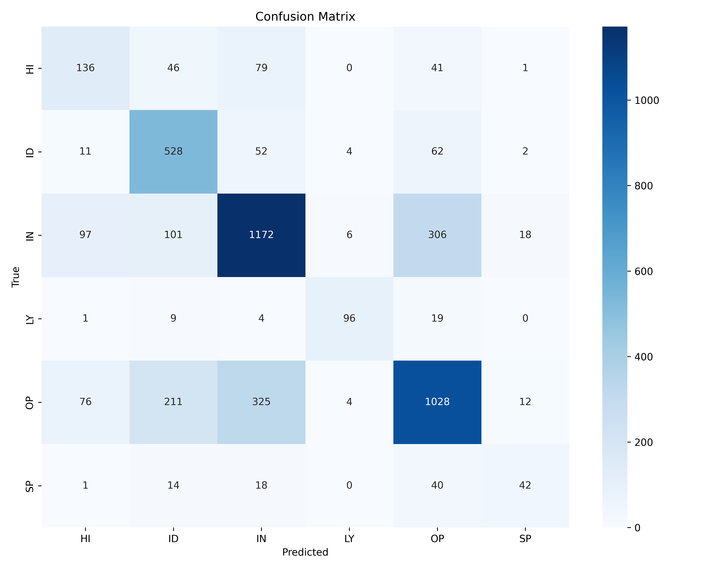
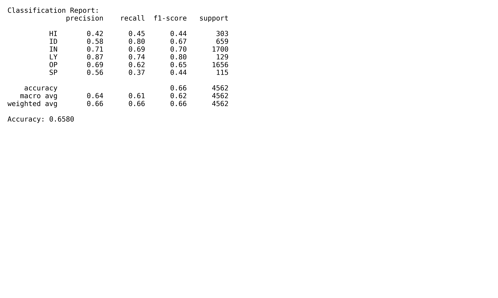

# Text Classification Project - Comparative Study of Deep Learning and Classical ML Models

---

## Overview

This repository contains implementations and evaluations of multiple text classification models applied on summarized and full-text datasets. The main goal is to compare the performance of state-of-the-art Deep Learning models (BERT, RoBERTa) against classical machine learning models (Logistic Regression, Random Forest, LightGBM and their ensemble) for multi-class classification tasks.

The project is structured to provide:

- Data preprocessing and label encoding
- Training and evaluation of different models on both full-text and summarized data
- Performance metrics including accuracy, confusion matrices, and classification reports
- Visualizations of training curves, confusion matrices, and detailed classification reports

---

## Dataset

- Initial raw data can be downloaded from the official CORE corpus repository:  
  [https://github.com/TurkuNLP/CORE-corpus](https://github.com/TurkuNLP/CORE-corpus)

- Training and testing datasets used in this project are preprocessed versions (summarized and full content) saved in CSV format:  
  - `train_data_summarize.csv`  
  - `test_data_summarize.csv`

- These datasets contain:  
  - A `content` column with text data (either full or summarized)  
  - A `category_code` column with class labels (excluding some classes like 'OTHER' and 'IP')

---

## Project Structure

```

/machine\_learning\_summarize/
├── best\_text\_model.joblib
├── label\_encoder.joblib
├── confusion\_matrix.png
├── classification\_report.png
├── machine\_learning\_summarize.ipynb
├── loss\_f1\_curve.png         # For deep learning models like BERT, RoBERTa
├── train\_data\_summarize.csv
├── test\_data\_summarize.csv

````

Note: Adjust paths accordingly if you move files.

---

## Models and Code

### 1. Deep Learning Models

- BERT base (full content)  
- BERT base (summarized content)  
- RoBERTa base (full content)  
- RoBERTa base (summarized content)  

**Code files:**  
- `bert_full_content.py`  
- `bert_summarize.py`  
- `roberta_full_content.py`  
- `roberta_summarize.py`  

These scripts implement fine-tuning of transformers on the text classification task, including data loading, training with early stopping, and evaluation. They save model checkpoints and plot learning curves (`loss_f1_curve.png`).

---

### 2. Classical Machine Learning Models

- LogisticRegressionCV (with cross-validation)  
- RandomForestClassifier  
- LightGBM  
- VotingClassifier ensemble (soft voting) of the above three models  

**Code file:**  
- `machine_learning_summarize.ipynb`

This notebook includes:  
- Data preprocessing and label encoding  
- TF-IDF vectorization (char-level n-grams 3-5)  
- Feature selection using Chi-square  
- Cross-validation results comparison  
- Final ensemble training and evaluation  
- Saving/loading models with `joblib`  
- Visualization of confusion matrix and classification report  

---

## Performance Summary

| Model                           | Dataset          | Accuracy  | Notes                             |
|--------------------------------|------------------|-----------|----------------------------------|
| RoBERTa base (full content)     | Full content     | 0.7444    | Best overall performance          |
| BERT base (full content)        | Full content     | 0.7321    | Competitive DL baseline           |
| RoBERTa base (summarized)       | Summarized       | 0.7164    | Slight drop due to summarization  |
| BERT base (summarized)          | Summarized       | 0.6900    | Slightly lower than RoBERTa summarize |
| Classical ML Ensemble (full)    | Full content     | 0.7203    | Logistic Regression + RF + LGBM   |
| Classical ML Ensemble (summarized) | Summarized   | 0.6580    | Lowest accuracy among models      |

---

## Visualizations

### Loss and F1 Curves for Deep Learning Models


*Figure 1: Training Loss and F1 score curves for BERT and RoBERTa models.*

---

### Confusion Matrices

Confusion matrices provide insight into model errors and class-wise performance.



*Figure 2: Confusion matrix for the final VotingClassifier on summarized data.*

---

### Classification Reports

Detailed classification reports showing precision, recall, and F1-score per class.



*Figure 3: Classification report for the final VotingClassifier on summarized data.*

---

## How to Run

1. **Setup Environment**

   Make sure to install required packages:

```bash
   pip install -r requirements.txt
````

Required libraries include:
`scikit-learn`, `lightgbm`, `transformers`, `torch`, `joblib`, `matplotlib`, `seaborn`, `tqdm`, `pandas`, `numpy`

2. **Download Initial Dataset**

   Download raw data from the CORE corpus repository:
   [https://github.com/TurkuNLP/CORE-corpus](https://github.com/TurkuNLP/CORE-corpus)

3. **Data Preparation**

   Preprocess raw data to generate summarized and full-text CSV files (`train_data_summarize.csv`, `test_data_summarize.csv`) and place them inside `/machine_learning_summarize/`.

4. **Run Classical ML Models**

   Run `machine_learning_summarize.ipynb` in a Jupyter environment to train and evaluate classical models. This notebook saves the final VotingClassifier model and label encoder.

5. **Run Deep Learning Models**

   Execute the relevant python scripts (`bert_full_content.py`, `bert_summarize.py`, `roberta_full_content.py`, `roberta_summarize.py`) to train and evaluate transformer models. These scripts save models and plot training curves.

6. **Visualize Results**

   Use the generated PNG files to analyze model performance visually.

---

## Notes and Recommendations

* For best results, use the full-text dataset with the RoBERTa base model.
* Summarized data tends to reduce accuracy, especially for classical ML models.
* The ensemble of classical ML models offers a reasonable alternative when computational resources for deep learning are limited.
* Further fine-tuning and hyperparameter optimization may improve results.
* Consider expanding with additional transformer models or data augmentation techniques.

---


```
